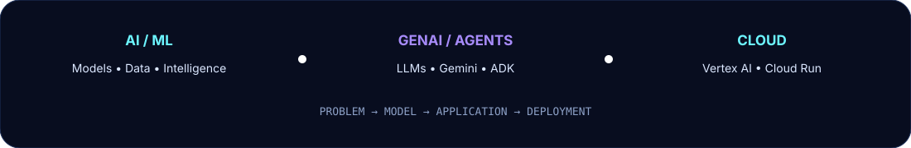
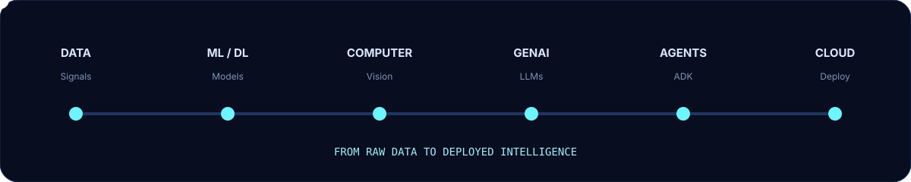
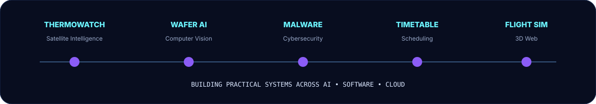
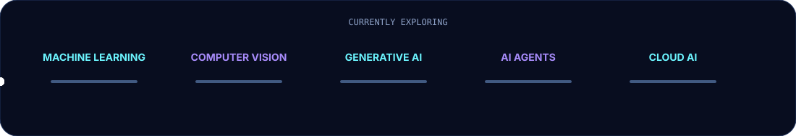

<div align="center">



<br/>

<a href="https://github.com/Harshitcodes154">

</a>
<a href="https://github.com/Harshitcodes154?tab=repositories">

</a>


</div>

---

<div align="center">



</div>

## 👨‍💻 About Me

```python
class HarshitKumar:

    role = "AI/ML Developer"
    education = "B.Tech — Artificial Intelligence & Machine Learning"

    interests = [
        "Machine Learning",
        "Deep Learning",
        "Computer Vision",
        "Generative AI",
        "AI Agents",
        "Cloud & AI Engineering",
        "Full-Stack Development",
        "Cybersecurity"
    ]

    currently_building = [
        "AI/ML applications",
        "GenAI & agentic systems",
        "Cloud-deployed AI products"
    ]

    philosophy = "Learn → Build → Break → Improve → Ship"
```

> I like taking ideas from **problem → prototype → working application → deployment**.

---

## ⚡ What I Build

<div align="center">



</div>

---

## 🚀 Featured Projects

### 🌡️ [ThermoWatch AI](https://github.com/Harshitcodes154/ThermoWatch-AI)
**Satellite Thermal Hotspot Detection & Industrial Fire-Risk Intelligence**

AI-driven system focused on satellite thermal hotspot detection, facility attribution and industrial fire-risk intelligence.

`AI/ML` `Computer Vision` `Satellite Data` `Geospatial Intelligence`

---

### 🧠 [AI Wafer Defect Detection](https://github.com/Harshitcodes154/AI-Wafer-Defect-Detection)
**Image-Based Wafer Map Pattern Intelligence**

Computer Vision system for wafer defect-pattern analysis using deep learning and explainability.

`CNN` `Deep Learning` `Computer Vision` `Grad-CAM`

---

### ❄️ [Ashoka Cooling Point](https://github.com/Harshitcodes154/Ashoka-Cooling-Point)

Engineering-focused project exploring thermal/cooling monitoring and application development.

---

### 🛡️ [Malware Detection](https://github.com/Harshitcodes154/Malware_detection)

Machine-learning based exploration of automated malware detection and classification.

`Python` `Machine Learning` `Cybersecurity`

---

### 📅 [SIH TimeTable](https://github.com/Harshitcodes154/SIH_TimeTable)

Software solution for academic timetable and scheduling problems.

`TypeScript` `JavaScript` `Scheduling`

---

### ✈️ [Web Flight Simulator](https://github.com/Harshitcodes154/web-flight-simulator)

Interactive browser-based flight simulator using 3D web technologies.

`JavaScript` `Three.js` `CesiumJS` `WebGL`

---

<div align="center">



</div>

---

## 🧰 Tech Stack

<div align="center">


<br/><br/>


</div>

---

## 🏆 Hackathons & Technical Challenges

<div align="center">


</div>

---

## 🧠 Currently Exploring

<div align="center">



</div>

- Advanced Machine Learning & Deep Learning
- Computer Vision
- Generative AI & LLM applications
- AI Agents / Agentic AI
- Google Cloud, Vertex AI & Cloud Run
- Data Structures & Algorithms
- Cybersecurity
- Production-ready AI engineering

---

## 📊 GitHub Analytics

<div align="center">


<br/><br/>


<br/><br/>


</div>

---

## 🐍 Contribution Activity

<div align="center">


</div>

---

## 🎯 2026 Mission

```text
                 ┌──────────────────────┐
                 │   MASTER AI / ML     │
                 └──────────┬───────────┘
                            ↓
                 ┌──────────────────────┐
                 │      GENAI           │
                 └──────────┬───────────┘
                            ↓
                 ┌──────────────────────┐
                 │    AI AGENTS         │
                 └──────────┬───────────┘
                            ↓
                 ┌──────────────────────┐
                 │   CLOUD DEPLOYMENT   │
                 └──────────┬───────────┘
                            ↓
                 ┌──────────────────────┐
                 │   REAL AI PRODUCTS   │
                 └──────────────────────┘
```

---

## 🤝 Let's Build

Open to collaborating on:

**AI/ML · Generative AI · AI Agents · Computer Vision · Cloud · Open Source · Cybersecurity · Hackathons**

<div align="center">

<a href="https://github.com/Harshitcodes154">

</a>

</div>

<br/>

<div align="center">


### ⚡ BUILD • LEARN • SHIP • REPEAT

</div>
