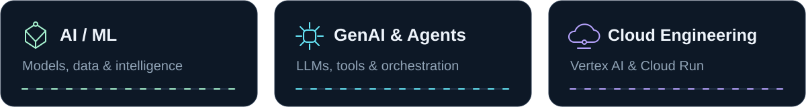
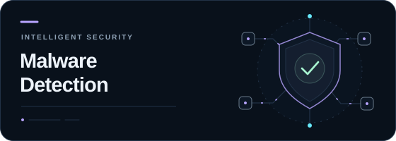
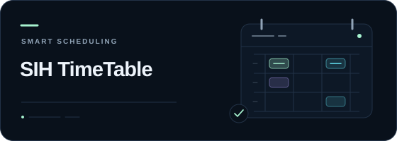
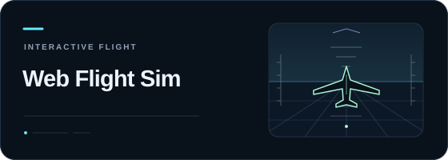
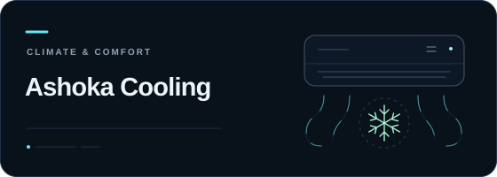
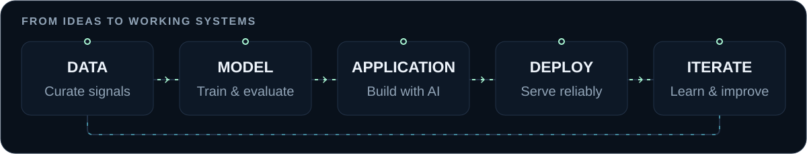
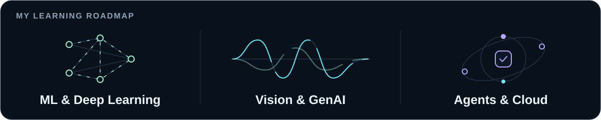
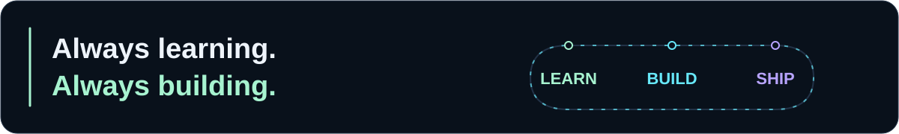

<picture>
  <source media="(max-width: 600px)" srcset="./assets/profile-header-mobile.svg" />
  
</picture>

 

**From a curious idea to a working AI product.**

Machine learning · Computer vision · Generative AI · Cloud engineering

[About](#a-little-about-me) &nbsp; / &nbsp; [Projects](#selected-projects) &nbsp; / &nbsp; [Stack](#my-toolkit) &nbsp; / &nbsp; [Learning](#on-my-radar) &nbsp; / &nbsp; [Connect](#lets-build-something)

 

## A little about me

I'm **Harshit Kumar**, an **AI/ML developer**. I enjoy connecting models, software, and cloud infrastructure to turn interesting problems into useful applications.

- **Education:** B.Tech — Artificial Intelligence & Machine Learning.
- **Building:** AI/ML applications, GenAI tools, and agentic systems.
- **Exploring:** computer vision, cloud-deployed AI, and production-ready engineering.
- **Also curious about:** full-stack development, cybersecurity, and interactive 3D experiences.
- **My approach:** learn → build → break → improve → ship.



 

## Selected projects

A few places where curiosity turned into code. **Click a card to explore the repository.**

<table>
<tr>
<td width="50%" valign="top">
<a href="https://github.com/Harshitcodes154/ThermoWatch-AI"></a>
<h3><a href="https://github.com/Harshitcodes154/ThermoWatch-AI">ThermoWatch AI ↗</a></h3>

Satellite thermal hotspot detection, facility attribution, and industrial fire-risk intelligence.

<code>AI/ML</code> <code>Computer Vision</code> <code>Geospatial</code>

</td>
<td width="50%" valign="top">
<a href="https://github.com/Harshitcodes154/AI-Wafer-Defect-Detection"></a>
<h3><a href="https://github.com/Harshitcodes154/AI-Wafer-Defect-Detection">AI Wafer Defect Detection ↗</a></h3>

Deep learning and explainability for image-based wafer defect-pattern analysis.

<code>CNN</code> <code>Deep Learning</code> <code>Grad-CAM</code>

</td>
</tr>
<tr>
<td width="50%" valign="top">
<a href="https://github.com/Harshitcodes154/Malware_detection"></a>
<h3><a href="https://github.com/Harshitcodes154/Malware_detection">Malware Detection ↗</a></h3>

Exploring automated malware detection and classification with machine learning.

<code>Python</code> <code>Machine Learning</code> <code>Security</code>

</td>
<td width="50%" valign="top">
<a href="https://github.com/Harshitcodes154/SIH_TimeTable"></a>
<h3><a href="https://github.com/Harshitcodes154/SIH_TimeTable">SIH TimeTable ↗</a></h3>

A software solution for academic timetabling and scheduling problems.

<code>TypeScript</code> <code>JavaScript</code> <code>Scheduling</code>

</td>
</tr>
<tr>
<td width="50%" valign="top">
<a href="https://github.com/Harshitcodes154/web-flight-simulator"></a>
<h3><a href="https://github.com/Harshitcodes154/web-flight-simulator">Web Flight Simulator ↗</a></h3>

An interactive browser-based flight simulator built with 3D web technologies.

<code>Three.js</code> <code>CesiumJS</code> <code>WebGL</code>

</td>
<td width="50%" valign="top">
<a href="https://github.com/Harshitcodes154/Ashoka-Cooling-Point"></a>
<h3><a href="https://github.com/Harshitcodes154/Ashoka-Cooling-Point">Ashoka Cooling Point ↗</a></h3>

An engineering project exploring thermal and cooling monitoring through application development.

<code>Thermal Monitoring</code> <code>Applications</code>

</td>
</tr>
</table>

<a href="https://github.com/Harshitcodes154?tab=repositories"><b>Explore all repositories →</b></a>

 

## My toolkit

 

| Area | Technologies & interests |
| :--- | :--- |
| **AI & machine learning** | Python · Machine Learning · Deep Learning · CNNs · Computer Vision · Grad-CAM |
| **Generative AI & agents** | Gemini · Google ADK · LLM applications · Agentic AI |
| **Web & software** | TypeScript · JavaScript · React · Node.js · FastAPI · HTML · CSS |
| **Cloud & developer tools** | Google Cloud · Vertex AI · Cloud Run · Docker · Git · GitHub · Linux · VS Code |
| **Foundations** | Java · C++ · Data Structures & Algorithms · Cybersecurity |

 

## How I like to build

Start with a real problem. Understand the data. Build, deploy, and keep improving.



 

## On my radar



**My 2026 direction:** deepen my ML foundations, build better GenAI and agentic applications, and bring them to life on the cloud.

- Advanced machine learning, deep learning, and computer vision.
- LLM applications, AI agents, and the Google Cloud ecosystem.
- Data structures, cybersecurity, and dependable AI engineering.

<b>Hackathons & technical challenges</b>

 

| Challenge | Focus |
| :--- | :--- |
| Google Gen AI Academy — APAC 2026 | Generative AI |
| SanDisk Hackathon | AI / ML |
| PixelHack | Game development |
| Null Chapter | Capture the flag |

 

## GitHub activity

[Repositories](https://github.com/Harshitcodes154?tab=repositories) &nbsp; · &nbsp; [Contribution history](https://github.com/Harshitcodes154?tab=overview) &nbsp; · &nbsp; [Stars](https://github.com/Harshitcodes154?tab=stars)

 

## Let's build something

I'm open to collaborating on **AI/ML, Generative AI, AI agents, computer vision, cloud, open source, cybersecurity, and hackathons**.

Have an idea that could use a model, an agent, or a little engineering curiosity? Let's connect.

 


